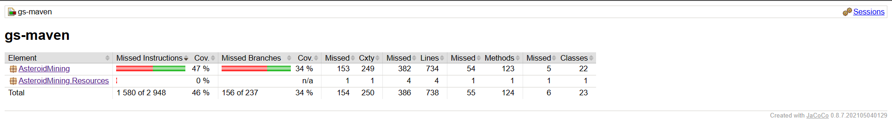
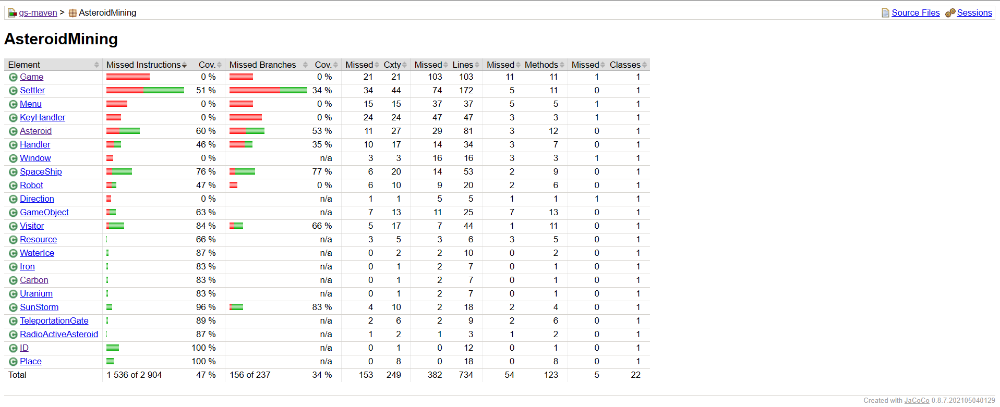

# Coverage

This document provides coverage analysis and relevant information about the codebase. 

To generate the coverage report our team has followed the following steps: building the project using Maven, generating a code coverage report using the JaCoCo Maven plugin, publishing the coverage report to GitHub Pages, and building and pushing a Docker image. The coverage report is hosted on GitHub Pages and can be accessed at [Coverage Report Link](https://bme-mit-iet.github.io/ivt-hw-2023-200-ok-v-2/).

In the coverage report, there are two main elements: **AsteroidMining** and **AsteroidMining.Resources**. 
The AsteroidMining element represents a primary component or module within the project. It contains multiple classes, and the overall coverage for this element is 46%. AsteroidMining.Resources is a class that contains a single enum ith a respective 0% coverage.

Module AsteroidMining contains GUI classes( Game, Window, Menu, KeyHandler), which are not covered by tests. As a result, the coverage percentage is 0% for all metrics. 
Class Direction is an Enum class with coverage 0%.

## Conclusion

The overall coverage is reasonably high, but there are specific areas that require attention, such as Game class.