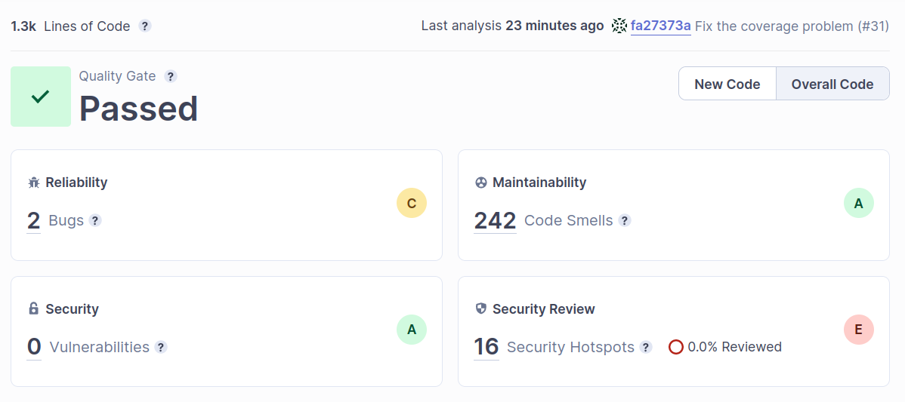
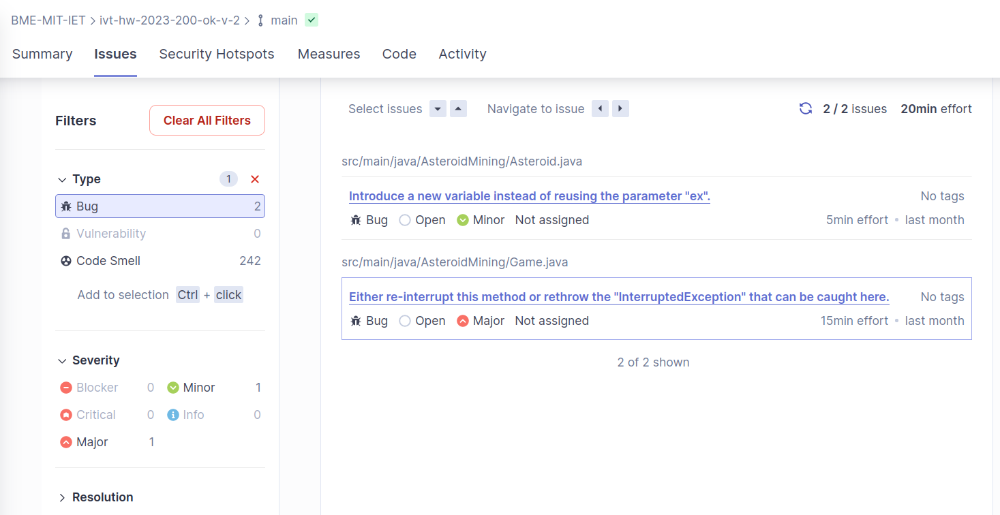

## SonarCloud Code analysis

Sonar Cloud was used to analyze the quality of the code. The report can be accessed at https://sonarcloud.io/summary/overall?id=BME-MIT-IET_ivt-hw-2023-200-ok-v-2.
The results are as follows: 

Reliability rating C, 2 bugs. One of them minor and the other one major. The reliability rating indicates the code's reliability and stability. A rating of C suggests there might be room for improvement in terms of reliability. 

Maintainability Rating A, 242 Code Smells. The maintainability rating reflects the code's ease of maintenance and understandability. An A rating indicates that the code is well-structured and readable. However, the presence of 242 code smells indicates that there is room for improvement (unused imports, package naming etc.)

Security Rating A, 0 Vulnerabilities. The security rating represents the code's security strength. An A rating indicates that the code has good security practices in place.

0.0 Duplications: Duplications refer to code segments that have been duplicated across the codebase. A value of 0.0 indicates that there are no instances of code duplication.

16 Security Hotspots found (1 for weak cryptography, the other 15 for empty exception catch blocks), that require manual assessment. 

