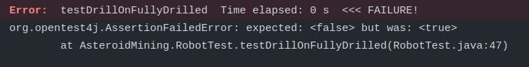
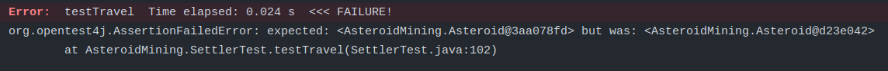
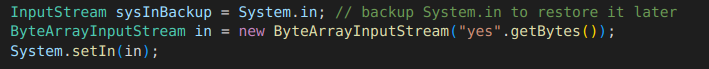

# Unit tests

Overall 61 unit tests were written for 8 different components, out of which 51 are successfull and 10 failed with errors. These test are executed automatically with every Maven build.

We decided to keep the test failures as normaly they would signal to the developers of the application that there is an issue to be fixed. For example:

This test from the RobotTest suite signalizes that when attempting to drill an empty asteroid (depth = 0), the expected result is false (you cannot drill an asteroid when it is fully drilled already). However, the actual return value is **true**, which, according to the project docs, is not a desired behavior. 

This test from the SettlerTest suite signalizes that one of the most important functions of the application, traveling between asteroids, is not working as expected.

Some functionalities require action from the user, for example confirming to build a robot or a gate. User input is simulated in the unit tests as well in the following way:

